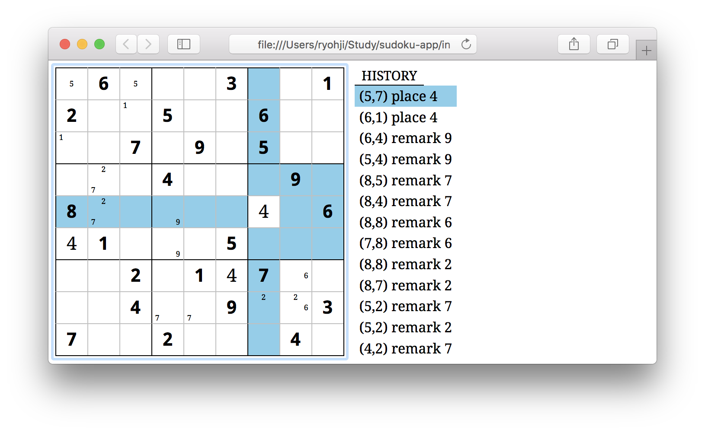
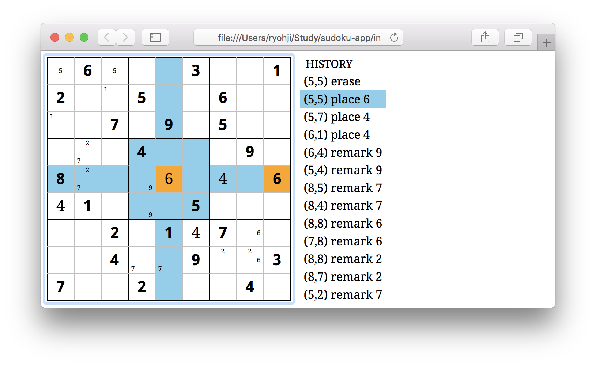

# sudoku-app
HTML based sudoku app.

## Live sample
https://ryohji.github.io/sudoku-app/

## Screen shot

You can place number on cells. And also can put or remove memo.

If your number obviously placed wrong position, it will be high-lighted.

## How to play

1. Move the cursor into the cell you want to place the number or put/remove memo.
2. Type the `number key` 1, 2, 3, ..., 9 to place the number.
3. Or `number key` with `Alt` (or `option` if you use macOS) to put memo.
4. You can remove memo to type `number key` with `Alt` and `Shift`.
5. You can delete your placed number with `Backspace` key.

With `Alt` + `Z`, you can back the history. `Alt` + `Shift` + `Z`, you can go forward.

There is no `EDIT` and `SAVE/LOAD`. (I'm now working on these)

## How to install

Clone this repo and open `index.html`.
